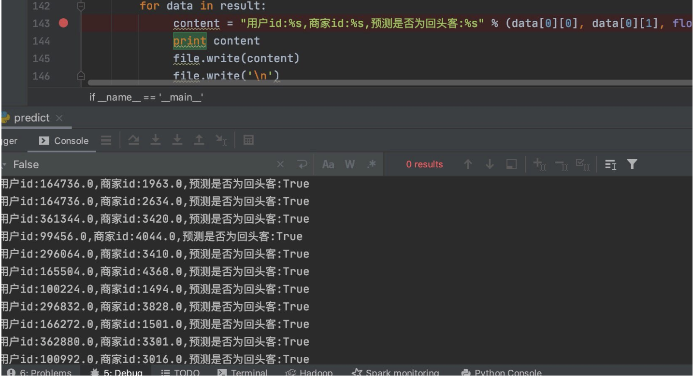
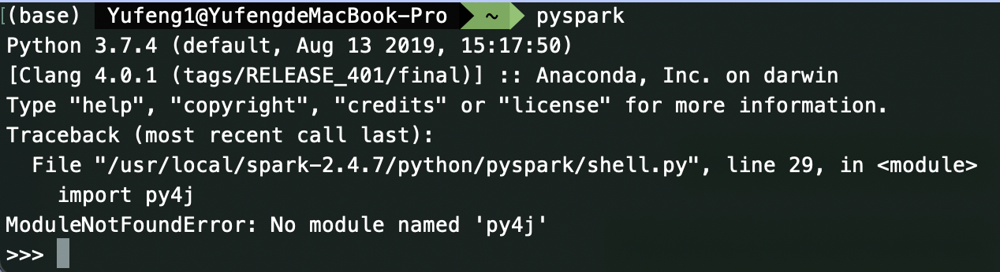
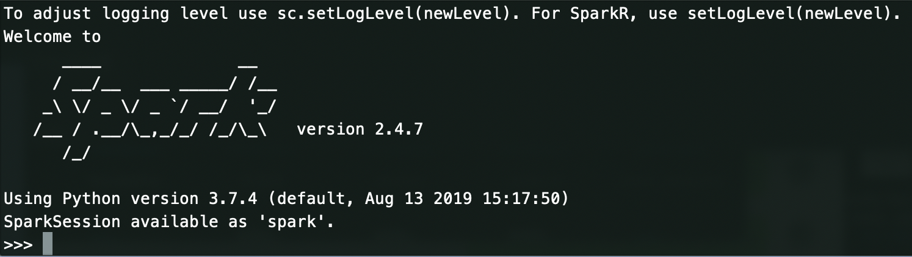
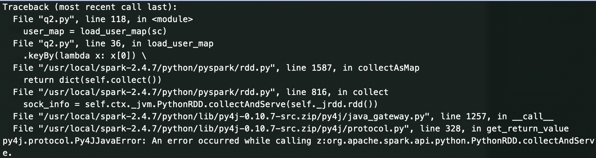
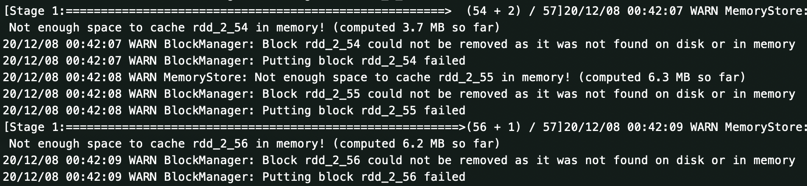

# 实验四 实验报告

*181830187 王宇烽*

* [x] 12.06更新：使用数据集的局部做测试，项目1～3程序做完，Debug结束
* [x] 12.08更新：实验报告v1.0
* [x] 12.10更新：项目4使用自己的算法参加比赛，成绩0.6826410，实时排名100
* [x] 12.12更新：项目4用spark做完，实验报告写完，成绩0.6826410，实时排名101
* [x] 12.14更新：成绩0.6881123，排名42
* [x] 12.22更新：成绩0.6901808，排名34
* [ ] 下周目标：提高排名

---

**代码结构：**

> **原始需求**
>
> > 实验四.pdf
>
> **源码**
>
> > hadoop-tm
> >
> > > pom.xml
> > >
> > > src（JAVA源代码）
> > >
> > > target
> > >
> > > hadoop_test0-1.0-SNAPSHOT.jar（maven打包的jar包）
> >
> > spark_q2.py（第一部分的spark部分和第二部分）
> >
> > spark_q3.py（第三部分）
> >
> > spark_predict.py（第四部分）
> >
> > ML_predict.ipynb（用其他的算法预测）
>
> **运行结果**
>
> > **hadoop打印输出**
> >
> > > age_30_top_merchant_result.csv 最受年轻人(age<30)关注的商家
> > >
> > > hot_item_result.csv 双十一最热门的商品
> > >
> > > merchant_count_result.csv 商家被关注度统计结果
> >
> > **spark输出**
> >
> > > age_30_top_merchant_result.csv 最受年轻人(age<30)关注的商家
> > >
> > > hot_item_result.csv 双十一最热门的商品
> > >
> > > merchant_count_result.csv 商家被关注度统计结果
> > >
> > > age_result.csv 统计购买了商品的买家年龄段的比例
> > >
> > > boy_girl_result.csv 统计双十一购买了商品的男女比例
> > >
> > > sparkML_predict.csv用spark的MLlib进行预测的结果
> > >
> >
> > python其他算法预测结果
> >
> > > XGBoost_prediction.csv 使用XGBoost算法计算预测的结果
> > >
> > > lightGBM_predict.csv 使用lightGBM算法计算预测的结果

---


一、分别编写MapReduce程序和Spark程序统计双十一最热门的商品和最受年轻人(age<30)关注的商家(“添加购物 +购买+添加收藏夹”前100名)

1. **MapReduce程序设计**

* 统计双十一最热门的商品

```
设计思路：一个MapReduce完成
程序的主体还是一个wordcount程序
参考源码中的HotItemMapper.java 和 HotItemReducer.java
以下展示Mapper程序
```

```java
    protected void map(LongWritable key, Text value, Context context){
        String line = value.toString().trim();
        if (line.length() <= 0) {
            return;
        }
        String[] word_array = line.split(",");
        if (word_array.length != 7 || !word_array[5].equals("1111")) {
            //过滤不正常的数据和非双十一的数据
            return;
        }
        String action_type = word_array[6];
        //过滤点击类型的数据
        if (action_type.equals("0")) {
            return;
        }
        String item_id = word_array[1];
        //统计商品id 和数量即可
        context.write(new Text(item_id), new IntWritable(1));
    }
```


* 最受年轻人(age<30)关注的商家

```
一开始设计了一个MapReduce用于统计各个商家的受关注程度
思路也是wordcount
参考源码中的MerchantTotalCountMapper.java和MerchantTotalCountReducer.java

但是实际上设计思路：可以只有一个MapReduce完成 
参考源码中的MerchantGrilLoveMapper.java 和 MerchantGrilLoveReducer.java
设计思路：首先定义一个Set用来存放Top100的数据，其次读入User_info表，用于判断用户年龄，最后数据清洗+wordcount来完成任务
```

```java
//定义数据类型：
class Tuple2 {
        Text item;
        IntWritable value;

        public Tuple2(Text item, IntWritable value) {
            this.item = item;
            this.value = value;
        }
    }

//存放top100的数据
    protected TreeSet<Tuple2> top100Set = new TreeSet<Tuple2>(new Comparator<Tuple2>() {
        public int compare(Tuple2 o1, Tuple2 o2) {
            if (o1.value.get() >= o2.value.get()) {
                return -1;
            } else {
                return 1;
            }
        }
    });
```

```java
//定义读取用户信息的函数
	protected void setup(Context context) throws IOException, InterruptedException {
        URI[] files = context.getCacheFiles();
        //读取用户信息数据
        String user_file = files[0].getPath();
        BufferedReader bufferedReader = new BufferedReader(new FileReader(user_file));
        String user = null;
        bufferedReader.readLine();
        while ((user = bufferedReader.readLine()) != null) {
            String[] info = user.split(",");
            if (info.length == 3) {
                String age_range = info[1];
                if (age_range.equals("3") || age_range.equals("2") || age_range.equals("1")) {
                    user_age_map.put(info[0], 1);
                }
            }
        }
    }

    private Boolean filterAge30(String user_id) {
        return user_age_map.containsKey(user_id);
    }

```

```java
    protected void map(LongWritable key, Text value, Context context){
        String line = value.toString().trim();
        if (line.length() <= 0) {
            return;
        }
        String[] word_array = line.split(",");
        if (word_array.length != 7 || !word_array[5].equals("1111")) {
            //过滤不正常的数据
            return;
        }
        String action_type = word_array[6];
        //过滤点击类型的数据
        if (action_type.equals("0")) {
            return;
        }
        //过滤年龄为30外以上的数据
        String user_id = word_array[0];
        if (!filterAge30(user_id)) {
            return;
        }
        String merchant_id = word_array[3];
        //统计商品id 和数量即可

        context.write(new Text(merchant_id), new IntWritable(1));

    }
```


2. **Spark程序设计**

* 统计双十一最热门的商品

  pyspark非常简洁，只要设计好RDD和过滤操作，排序和输出只要一行就搞定

```python
设计思路：使用pyspark设计
参考源码中的q2.py 
hot_item = shop_rdd \
.filter(lambda shopBehavior: shopBehavior[6] != '0') \
.map(lambda shopBehavior: (shopBehavior[1], 1)) \
.reduceByKey(add) \
.sortBy(lambda x: x[1], False).take(100)
print ('============最热门的商品top100==============')
save_hot_item(hot_item,'/tmp/tianmao/hot_item_result.csv')
```

* 最受年轻人(age<30)关注的商家

```python
设计思路：使用pyspark设计
参考源码中的q2.py 
top100_merchant = shop_rdd \
.filter(lambda shopBehavior:shopBehavior[6] != "0") \
.filter(lambda shopBehavior:filter_age_30(shopBehavior,user_map)) \
.map(lambda shopBehavior:(shopBehavior[3], 1)) \
.reduceByKey(add) \
.sortBy(lambda x: x[1], False).take(100)
print('============30 age_range top 100 merchant==============')
save_30_age_top100_merchant(top100_merchant,'/tmp/tianmao/age_30_top_merchant_result.csv')
```

---


二. 编写Spark程序统计双十一购买了商品的男女比例，以及购买了商品的买家年龄段的比例；

* 统计双十一购买了商品的男女比例

```python
设计思路：使用pyspark设计
参考源码中的q2.py 
boy_girl_result = shop_rdd \
.filter(lambda shopBehavior:shopBehavior[6] == "2") \
.filter(lambda shopBehavior: filter_gender(shopBehavior, user_map)) \
.map(lambda shopBehavior:(user_map[shopBehavior[0]][2],1)) \
.reduceByKey(add) \
.collect()
boy_girl_result_count = 0.0
for ele in boy_girl_result:
boy_girl_result_count = boy_girl_result_count + ele[1]
print("============购买了商品的男⼥⽐例t==============")
save_boy_girl_result(boy_girl_result,boy_girl_result_count,'/tmp/tianmao/boy_girl_result.csv')
```

* 统计购买了商品的买家年龄段的比例

```python
设计思路：使用pyspark设计
参考源码中的q2.py 
age_result = shop_rdd \
.filter(lambda x:x[6] == "2") \
.map(lambda shopBehavior:get_user_age(shopBehavior,user_map)) \
.filter(lambda x:x != None) \
.reduceByKey(add) \
.collect()
agg_result_count = 0.0
for ele in age_result:
agg_result_count = agg_result_count + ele[1]
print('============购买了商品的买家年龄段的比例==============')
save_age_result(age_result,agg_result_count,'/tmp/tianmaoage_result.csv')
```

---


三. 基于Hive或者Spark SQL查询双十一购买了商品的男女比例，以及购买了商品的买家年龄段的比例；

**使用Spark SQL**

* Spark SQL查询双十一购买了商品的男女比例

```python
设计思路：使用pyspark+Spark SQL设计
参考源码中的q3.py
from operator import add
from pyspark import SparkConf, SparkContext
import sys

from pyspark.sql import SparkSession

if __name__ == '__main__':
spark = SparkSession.builder.appName("tianmao_sql").master("local[*]").getOrCreate()
shop_df = load_shop_data(spark).cache()
user_df = load_user_map(spark).cache()

shop_df.createOrReplaceTempView('shop_data')
user_df.createOrReplaceTempView('user_info')

print("============购买了商品的男⼥⽐例t==============")
spark.sql('select gender,gender_count/sum(gender_count) over (partition  by 1) as percent from (select count(*)as gender_count,gender from shop_data join user_info on(user_info.user_id = shop_data.user_id) where '
'user_info.gender in (''1'',''0'')'
' and shop_data.action_type == ''2'' group by gender)data  ') \
.show(10)
```

* Spark SQL查询购买了商品的买家年龄段的比例

```python
设计思路：使用pyspark+Spark SQL设计
参考源码中的q3.py
from operator import add
from pyspark import SparkConf, SparkContext
import sys

from pyspark.sql import SparkSession

if __name__ == '__main__':
spark = SparkSession.builder.appName("tianmao_sql").master("local[*]").getOrCreate()
shop_df = load_shop_data(spark).cache()
user_df = load_user_map(spark).cache()

shop_df.createOrReplaceTempView('shop_data')
user_df.createOrReplaceTempView('user_info')

print('============购买了商品的买家年龄段的比例==============')
spark.sql(
'select age_range,age_count/sum(age_count) over (partition  by 1) as percent from (select count(*)as age_count,age_range from shop_data join user_info on(user_info.user_id = shop_data.user_id) where '
' shop_data.action_type == ''2'' group by age_range)data  ') \
.show(10)
```


四、预测给定的商家中，哪些新消费者在未来会成为忠实客户，即需要预测这些新消费者在6个⽉月内再
次购买的概率。基于**Spark MLlib**编写程序预测回头客，评估实验结果的准确率。

1. 选用两种简单的机器学习算法：

   SVMWithSGD.train和DecisionTree.trainClassifier来练习spark下MLlib的学习

   思路：数据清洗--构建机器学习算法模型--预测

   具体执行的流程如下：
   
   - 首先，加载数据，并选择label
   
   ```python
       conf = SparkConf().setMaster("local[*]").setAppName("tianmao")
       sc = SparkContext(conf=conf)
       sc.setLogLevel("warn")
       user_map = load_user_map(sc)
       # 加载训练数据
       train_data = load_train_data(sc)
       # 设置数据的用户信息数据
       train_data_user_info = set_train_user_info(train_data, user_map)
       # user_id  merchant_id age_range gender label
    train_data_user_info.cache()
       stand_train_data_user_info = train_data_user_info.map(lambda user: user[0:4])
    stand_train_data_user_info_label = train_data_user_info.map(lambda user: user[4])
   ```
	
   - 第二步，训练数据标准化，并构建标签进行训练模型
   
   ```python
   	#训练数据标准化
       std_scaler = StandardScaler(True, True).fit(stand_train_data_user_info)
       stand_train_data_user_info = std_scaler.transform(stand_train_data_user_info)
       
       train_data_user_info = stand_train_data_user_info_label.zip(stand_train_data_user_info)
       # 构建标签数据
       train_data_user_info = build_point(train_data_user_info)
       numIterations = 100
   
       train_data_user_info.cache()
       
       #训练模型
       model = SVMWithSGD.train(train_data_user_info, numIterations)
       #model = DecisionTree.trainClassifier(train_data_user_info,numIterations,2,{})
   
   ```
   
   
   - 第三步，加载测试数据
   ```python
    	# 加载测试数据
    test_data = load_test_data(sc)
    # 设置数据的用户信息数据
    test_data_user_info = set_test_user_info(test_data, user_map)
    test_data_user_info.cache()
    
    # 测试数据标准化
    std_scaler = StandardScaler(True, True).fit(test_data_user_info)
    stand_test_data_user_info = std_scaler.transform(test_data_user_info)
    
    # 构建标签数据
    test_data_user_info = test_data_user_info.map(lambda user: user[0:2]).zip(build_vectors(stand_test_data_user_info))
   
   ```
   
   - 第四步，进行预测并输出结果
   ```python
   		# 进行预测
       #对test数据进行预测
       predict_data = test_data_user_info.map(lambda user: ((user[0][0], user[0][1]), model.predict(user[1])))
       #对训练集数据进行预测
       predict_self_data = train_data_user_info.map(
           lambda x: (x.features.values[0], x.features.values[1], x.label, model.predict(x.features)))
   
       # 计算准确率
       total_num = predict_self_data.count()
       correct_num = predict_self_data.filter(lambda x: float(x[2]) == float(x[3])).count()
       print("准确率:%s" % (correct_num / float(total_num)))
   ```
   





2. 自己学习的机器学习算法预测

思路：数据清洗--特征挖掘--机器学习算法预测

```python
# 读取数据的部分略去

# 一、数据清洗
train_data1['origin'] = 'train'
submission['origin'] = 'test'
matrix = pd.concat([train_data1, submission], ignore_index=True, sort=False)
matrix.drop(['prob'], axis=1, inplace=True)
# 连接user_info表，通过user_id关联
matrix = matrix.merge(user_info, on='user_id', how='left')
# 使用merchant_id（原列名seller_id）
user_log.rename(columns={'seller_id':'merchant_id'}, inplace=True)

# 格式化
user_log['user_id'] = user_log['user_id'].astype('int32')
user_log['merchant_id'] = user_log['merchant_id'].astype('int32')
user_log['item_id'] = user_log['item_id'].astype('int32')
user_log['cat_id'] = user_log['cat_id'].astype('int32')
user_log['brand_id'].fillna(0, inplace=True)
user_log['brand_id'] = user_log['brand_id'].astype('int32')
user_log['time_stamp'] = pd.to_datetime(user_log['time_stamp'], format='%m%d')
user_log['month'] = user_log['time_stamp'].astype(str).str[5:7]
# user_log['time_stamp'] = pd.to_datetime(user_log['time_stamp'], format='%H%M')
# 1 for <18; 2 for [18,24]; 3 for [25,29]; 4 for [30,34]; 5 for [35,39]; 6 for [40,49]; 7 and 8 for >= 50; 0 and NULL for unknown
matrix['age_range'].fillna(0, inplace=True)
# 0:female, 1:male, 2:unknown
matrix['gender'].fillna(2, inplace=True)
matrix['age_range'] = matrix['age_range'].astype('int8')
matrix['gender'] = matrix['gender'].astype('int8')
matrix['label'] = matrix['label'].astype('str')
matrix['user_id'] = matrix['user_id'].astype('int32')
matrix['merchant_id'] = matrix['merchant_id'].astype('int32')
del user_info, train_data1
gc.collect()
```


```python
# 二、特征工程（最为重要，还在补充特征）
选取指标：主要是针对<UserID, MerchantID>的pair，
首先，针对每个user，挖掘出过去六个月中购买记录
其次，针对每个merchant，挖掘出过去六个月商家被交互的user_id, item_id, cat_id, brand_id 唯一值
最后，按照user_id, merchant_id分组，统计行为个数，item_id, cat_id, brand_id唯一个数等特征
```


```python
# 三、模型训练
1. 使用XGBoost
# # 使用XGBoost
# model = xgb.XGBClassifier(
#     max_depth=8,
#     n_estimators=1000,
#     min_child_weight=300, 
#     colsample_bytree=0.8, 
#     subsample=0.8, 
#     eta=0.3,    
#     seed=42     
# )
# model.fit(
#     X_train, y_train,
#     eval_metric='auc', 
#     eval_set=[(X_train, y_train), (X_valid, y_valid)],
#     verbose=True,
#     #早停法，如果auc在10epoch没有进步就stop
#     early_stopping_rounds=10 
# )
# model.fit(X_train, y_train)
# 准确度 0.6791504 

2. 使用lightGBM
import lightgbm as lgb
# 使用LightGBM模型
model = lgb.LGBMClassifier(
    num_leaves=51,
    max_depth=10,
    boosting_type='gbdt',
    objective='binary',
    learning_rate=0.015,
    n_estimators=2000,
    subsample=0.75,
    subsample_freq=2,
    reg_lambda=0.28,
    reg_alpha=0.12,
    colsample_bytree=0.8,
    min_child_samples=300,
    min_split_gain=0.1
)
model.fit(
    X_train, y_train,
    eval_set=[(X_train, y_train), (X_valid, y_valid)],
    eval_metric='auc', 
    early_stopping_rounds=100
)
# 准确度 0.6826410
```

可以看出lightGBM可以提高预测的准确度


3. 成绩总结

   


五、问题总结

1. spark环境配置问题

   - 下载spark2.4.7安装包（在我的网络环境下需要科学上网才能安装），然后移动到/usr/local目录下

   - pip3 install pyspark

   - 修改～/.bash_profile 加入
   
     ```bash
     export SPARK_HOME=/usr/local/spark-2.4.7
     export PATH=$PATH:$SPARK_HOME/bin
     export PYTHONPATH=$SPARK_HOME/python/:$PYTHONPATH
     export PYTHONPATH=$SPARK_HOME/python/lib/py4j-0.10.7-src.zip:$PYTHONPATH
     ```



一开始出现这个问题 只要加入上述配置中的后两行就可以



退出shell 运行Python程序



出现如上错误 

说明是JAVA运行版本的问题

在spark-env.sh（复制template）里面修改

```bash
export JAVA_HOME="/Library/Java/JavaVirtualMachines/jdk1.8.0_261.jdk/Contents/Home"
export PYSPARK_PYTHON=python3
```

然后就可以正常运行



提示没有足够的内存时，会自动WARN

解决方法：

- 增加内存（不太可能）
- `rdd.persist(StorageLevel.MEMORY_ONLY_SER)` 序列化RDD文件来减少内存
- `rdd.persist(StorageLevel.MEMORY_AND_DISK)` 通过持久化文件来减少内存开销


2. 


